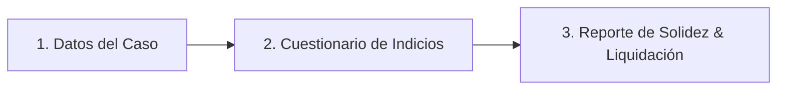
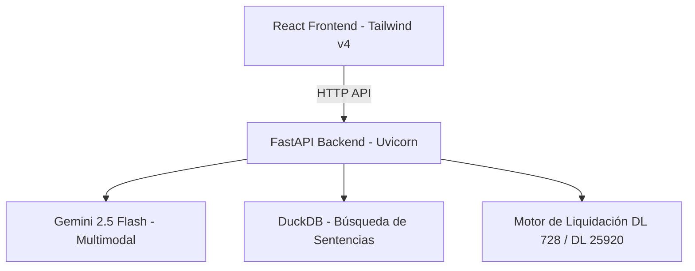

# Presentación del Proyecto: DesnaturalizaCheck v2.0
*Diagnóstico Inteligente de Laboralidad y Cálculo de Beneficios Sociales en el Perú*

---

## 📋 Tabla de Contenido
1. **El Problema**: Contratos encubiertos en el Perú
2. **La Solución**: DesnaturalizaCheck v2.0
3. **Propuesta de Valor & Funcionalidades**
4. **Demostración de Arquitectura & Tecnología**
5. **Impacto y Escalabilidad**

---

````carousel
# Slide 1: Portada
## DesnaturalizaCheck v2.0
### Inteligencia Artificial para la Justicia Laboral en el Perú

**Una plataforma inteligente de diagnóstico legal y financiero para trabajadores bajo contratos de locación de servicios encubiertos.**

* **Autor**: Equipo de Desarrollo - Hackathon 2026
* **Tecnologías**: React, FastAPI, Gemini 2.5, DuckDB
* **Despliegue**: AWS EC2 & Docker Compose

> [!NOTE]
> Diseñado para democratizar la asesoría laboral y agilizar la toma de decisiones legales con soporte de jurisprudencia real.

<!-- slide -->

# Slide 2: El Problema
## El Fraude de la Relación Laboral Encubierta en Perú

* **Realidad Nacional**: Miles de trabajadores son contratados bajo la modalidad civil de **Locación de Servicios** (Recibos por Honorarios) para evitar el pago de beneficios laborales.
* **Criterio Judicial**: La ley peruana aplica el **Principio de Primacía de la Realidad**. Si hay subordinación, horario y herramientas provistas, la relación es laboral (DL 728).
* **Barrera de Acceso**: Los trabajadores no conocen su nivel de solidez legal, no saben calcular su liquidación teórica con intereses, y no tienen acceso fácil a jurisprudencia de soporte.

> [!WARNING]
> La falta de información oportuna genera que los plazos de reclamo prescriban (4 años de cese, Ley 27321) o que los trabajadores concilien por montos muy inferiores a los de la ley.

<!-- slide -->

# Slide 3: La Solución
## DesnaturalizaCheck: De la Incertidumbre al Diagnóstico de Solidez

Una aplicación web interactiva en 3 simples pasos:



1. **Datos Básicos + IA Vision**: Registro de fechas, sueldo y carga de boletas/recibos.
2. **Cuestionario Simplificado**: Evaluación interactiva de subordinación mediante tarjetas de un solo clic.
3. **Reporte Completo**: Entrega del score de solidez, cálculo financiero neto (reclamable vs. prescrito) y precedentes judiciales vinculantes.

<!-- slide -->

# Slide 4: Funcionalidades Innovadoras
## Tecnología Multimodal y Finanzas Personalizadas

* **📸 Auto-completado Multimodal (IA Vision)**:
  * El usuario sube una foto de su boleta de pago o liquidación.
  * **Gemini 2.5 Flash** procesa la imagen y auto-completa el sueldo, fechas y beneficios ya pagados.
* **🛠️ Calculadora Financiera con Deducciones**:
  * Resta días de vacaciones gozadas físicas.
  * Deduce CTS y Gratificaciones pagadas parcialmente.
  * Calcula intereses legales de forma dinámica (Decreto Ley 25920).
* **⚖️ Buscador Semántico Judicial**:
  * Compara el caso del usuario contra sentencias reales de **El Peruano** en milisegundos mediante vectores.

<!-- slide -->

# Slide 5: Arquitectura de la Solución
## Stack Moderno, Ligero y Optimizado para Cloud



* **Frontend**: React + Tailwind CSS v4, con interfaz premium oscura, glassmorphic y tarjetas de un solo clic.
* **Backend**: FastAPI (Python 3.11), optimizado con PyTorch CPU-only (reducción de imagen Docker de 4GB a ~200MB).
* **Base de Datos**: DuckDB local para almacenamiento y búsqueda vectorial de jurisprudencia en el servidor.

<!-- slide -->

# Slide 6: El Reporte de Exportación (PDF)
## Formatos de Alta Gama para el Trabajador

El sistema exporta un documento PDF formal con diseño de nivel ejecutivo:
* **Ficha de Metadatos**: Resumen del caso estructurado en cajas de datos.
* **Tabla de Beneficios Detallada**: CTS, Gratificaciones, Vacaciones, Bonificación del 9% e Intereses Legales presentados con filas alternadas y totales destacados.
* **Precedentes Judiciales Calientes**: Muestra los expedientes más similares que ganaron casos análogos con enlaces directos para descargar las sentencias completas en PDF oficial de El Peruano.
* **Alertas de Prescripción**: Notificaciones visuales de riesgo legal si el caso supera los 4 años del cese.

<!-- slide -->

# Slide 7: Conclusión & Impacto
## Democratizando el Acceso a la Justicia Laboral

* **Para el Trabajador**: Le otorga herramientas financieras y legales sólidas antes de iniciar una negociación o demanda.
* **Para los Abogados**: Un pre-filtro de casos en segundos con base jurisprudencial indexada lista para citar.
* **Escalabilidad**: Desplegado en AWS EC2 bajo contenedores Docker, listo para integrarse a plataformas del Ministerio de Trabajo o consultorios jurídicos populares.

> [!TIP]
> **DesnaturalizaCheck v2.0** es la unión perfecta entre Inteligencia Artificial Multimodal, Ingeniería de Datos Jurisprudenciales y Diseño de Experiencia de Usuario de Primer Nivel.
````
