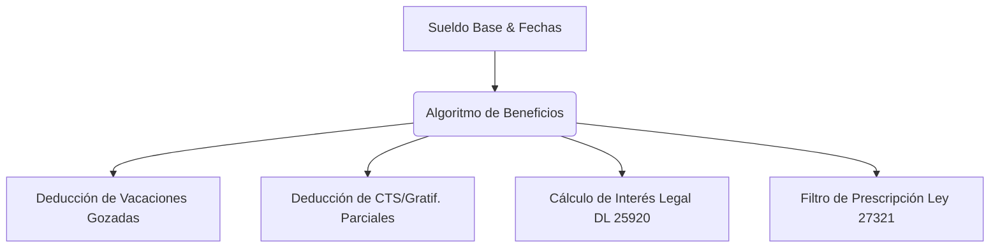

# Presentación del Proyecto: DesnaturalizaCheck v2.0
*El Core: La Calculadora Inteligente de Beneficios Sociales y su Impacto en el Trabajador Peruano*

---

## 📋 Tabla de Contenido
1. **El Problema**: La dificultad y opacidad en el cálculo de Beneficios Sociales en Perú
2. **El Aporte Principal**: La Calculadora Inteligente y Personalizada DesnaturalizaCheck
3. **Funcionalidades de Personalización** (Deducciones, Vacaciones e Intereses)
4. **Demostración de Arquitectura & Tecnología**
5. **Impacto, Transparencia y Escalabilidad**

---

````carousel
# Slide 1: Portada
## DesnaturalizaCheck v2.0
### Democratizando la liquidación de beneficios mediante Tecnología e Inteligencia Artificial

**Una plataforma enfocada en resolver el cálculo complejo de beneficios laborales no pagados o pagados parcialmente bajo contratos de locación encubiertos.**

* **Autor**: Equipo de Desarrollo - Hackathon 2026
* **Enfoque Core**: Calculadora Matemática Financiera Laboral (DL 728 & DL 25920)
* **Despliegue**: AWS EC2 & Docker Compose

> [!NOTE]
> Resolviendo la asimetría de información: empoderamos al trabajador con cálculos exactos antes de conciliar o demandar.

<!-- slide -->

# Slide 2: El Problema Central
## La Complejidad y Opacidad en el Cálculo de Beneficios Laborales

* **Falta de Personalización**: Las calculadoras online actuales son estáticas y "todo o nada". Asumen que no se pagó nada, ignorando si el trabajador recibió pagos parciales o si gozó de días de vacaciones físicos.
* **El Laberinto de los Intereses (DL 25920)**: Calcular los intereses legales acumulados desde la fecha de cese hasta hoy es una tarea compleja que usualmente requiere un perito contable.
* **La Prescripción Silenciosa (Ley 27321)**: El derecho a reclamar los beneficios laborales prescribe a los 4 años del cese. Los trabajadores calculan montos que ya perdieron legalmente sin saberlo.

> [!WARNING]
> La falta de una herramienta accesible de cálculo real y personalizado obliga a los trabajadores a aceptar liquidaciones informales muy por debajo de lo que la ley peruana dictamina.

<!-- slide -->

# Slide 3: El Aporte Principal
## La Calculadora Inteligente de Beneficios Sociales

Nuestra calculadora transforma la experiencia de liquidación laboral mediante un algoritmo preciso y adaptativo:



* **Cálculo Real, no Teórico**: Considera el historial real del trabajador introduciendo deducciones por beneficios que el empleador ya le adelantó o pagó parcialmente.
* **Diferenciación Visual Inmediata**: Clasifica de forma transparente qué parte de la deuda sigue siendo **Reclamable** y qué parte ya **Prescribió** (se perdió por el tiempo).

<!-- slide -->

# Slide 4: Funcionalidades de Personalización
## Control Total de las Variables Financieras en la UI

* **🛠️ Sección de Deducciones y Beneficios Recibidos**:
  * **Vacaciones Gozadas**: El sistema calcula los días generados (2.5 por mes) y descuenta los días gozados para liquidar únicamente la diferencia monetaria.
  * **CTS y Gratificaciones ya Pagadas**: Evita el cobro duplicado restando pagos parciales previos del total acumulado.
* **📸 Lectura de Boletas con IA (Gemini 2.5 Flash)**:
  * Permite subir una imagen de una boleta de pago o liquidación previa.
  * La IA extrae automáticamente el sueldo, fechas y conceptos ya abonados para alimentar la calculadora sin errores de escritura.

<!-- slide -->

# Slide 5: El Reporte de Liquidación (PDF)
## Transparencia Financiera en un Documento Ejecutivo

El reporte en PDF ha sido rediseñado para servir como una **Hoja de Liquidación de Nivel Judicial**:
* **Tabla de Doble Entrada**: Muestra cada concepto (CTS, Gratificación, Vacaciones, Bonificación de Salud del 9% e Intereses) separado en dos columnas claras: **Monto Reclamable** y **Monto Prescrito**.
* **Cálculo de Intereses Legales**: Desglosa de forma detallada los intereses del Decreto Ley 25920 acumulados por el tiempo transcurrido desde el cese.
* **Alertas Rojas de Riesgo**: Destaca si el total reclamable está cerca de prescribir o ya prescribió totalmente.

<!-- slide -->

# Slide 6: Arquitectura de la Calculadora
## Precisión Matemática y Despliegue Robusto

* **Algoritmo de Liquidación**: Implementado en Python puro (`src/liquidacion.py`) con validación de fechas nativas, asegurando consistencia matemática sin dependencias pesadas.
* **Frontend React + Tailwind CSS v4**: Interfaz glassmorphic moderna con inputs de deslizamiento y visualización del cálculo en tiempo real.
* **Respaldo Jurisprudencial**: El backend vincula el cálculo financiero con sentencias reales de desnaturalización (Top-3 de El Peruano) usando búsqueda vectorial en DuckDB.

<!-- slide -->

# Slide 7: Impacto y Conclusión
## Equilibrio de Poder en la Conciliación Laboral

* **Justicia Financiera**: Reduce drásticamente la asimetría de información. El trabajador llega a la SUNAFIL o al juzgado sabiendo exactamente cuánto le corresponde cobrar.
* **Eficiencia Legal**: Permite a abogados y defensores públicos emitir pre-liquidaciones completas en segundos en lugar de horas.
* **Preparado para Escalar**: Empaquetado bajo Docker Compose y listo para ser desplegado como una API pública para ministerios, sindicatos o consultoras legales a nivel nacional.

> [!TIP]
> **DesnaturalizaCheck v2.0** no es solo un evaluador de contratos; es una **Calculadora de Beneficios Laborales de Precisión** que combina IA vision, peritaje legal y diseño premium.
````
